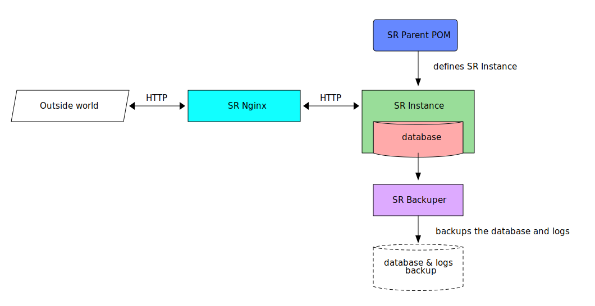
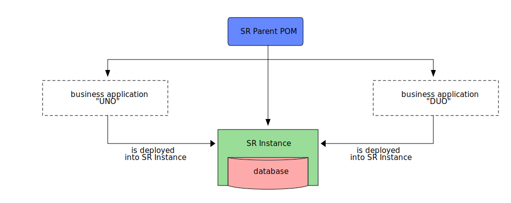
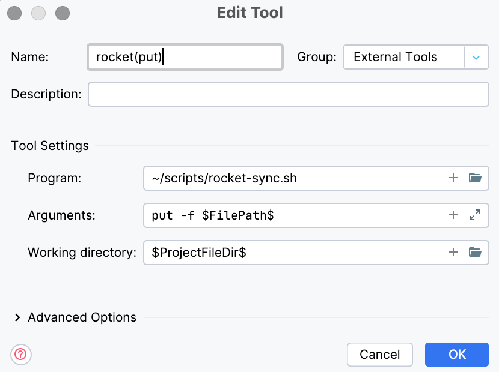
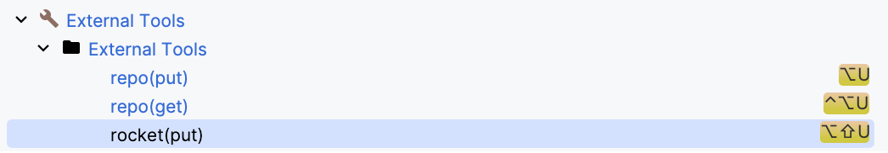
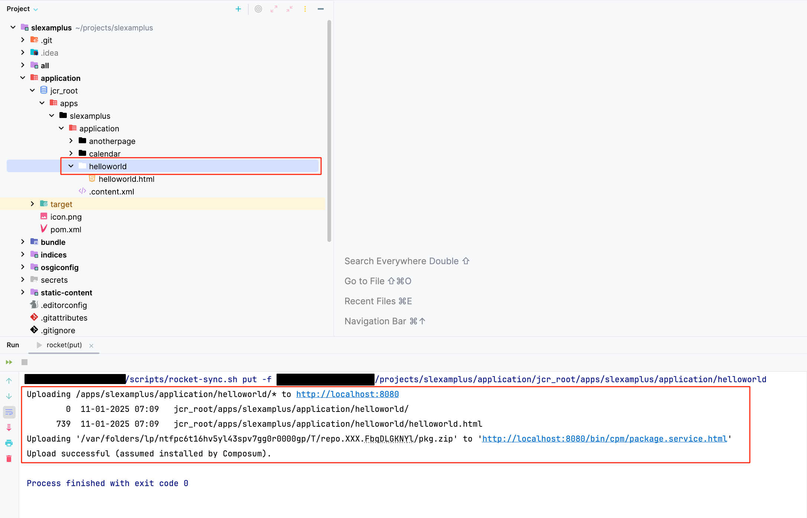

[.text-justify]
= Sling Rocket
:reproducible:
:doctype: article
:author: Herman Ciechanowiec
:email: herman@ciechanowiec.eu
:chapter-signifier:
:sectnums:
:sectnumlevels: 5
:sectanchors:
:toc: left
:toclevels: 5
:icons: font
// Docinfo is used for foldable TOC.
// -> For full usage example see https://github.com/remkop/picocli
:docinfo: shared,private
:linkcss:
:stylesdir: https://www.ciechanowiec.eu/linux_mantra/
:stylesheet: adoc-css-style.css
:!table-caption:

== Overview

_Sling Rocket_ is a framework for building dynamic web applications.

== Architecture

=== Sling Rocket Components

_Sling Rocket_ consists of four basic parts:
[upperalpha]
. Sling Rocket Parent POM ("*SR Parent POM*")
+
A Maven project object model that declaratively describes basic and universal application components of _Sling Rocket_.
. Sling Rocket Instance ("*SR Instance*")
+
[upperroman]
.. A standalone long-running OSGi container.
.. Serves as the environment inside which business applications are running. Among others, it means that the SR Instance contains default dependencies and configurations that can be used by embedded business applications. The SR Instance itself is responsible for all non-business-related logic.
.. Defined by the SR Parent POM.
.. Has an embedded NoSQL database - Apache Jackrabbit Oak (Java Content Repository, JCR). It can be simultaneously connected to other databases.
+
. Sling Rocket Backuper ("*SR Backuper*")
+
Application that performs backups of the database via backing it up into a separate destination.
. Sling Rocket Nginx ("*SR Nginx*")
+
Reverse proxy Nginx server that serves as a gateway between the SR Instance and the outside world. It is responsible for all incoming and outgoing HTTP(S) traffic.

.Raw diagram
[%collapsible]
====
[ditaa, shadows=false, separation=false, target=docs/img/sling-rocket-components-diagram, format=svg, opts=inline]
....
                                                                /--------------\
                                                                |              |
                                                                | SR Parent POM|
                                                                |   c68F       |
                                                                \-------+------/
                                                                        |
                                                                        |defines SR Instance
                                                                        |
                                                                        v
+-------------------+          +-------------------+          +---------+---------+
|                   |   HTTP   |                   |   HTTP   |                   |
|   Outside world   +<-------->|      SR Nginx     +<-------->|    SR Instance    |
|{io}               |          |c1FF               |          | cGRE              |
+-------------------+          +-------------------+          | +---------------+ |
                                                              | |               | |
                                                              | |    database   | |
                                                              | |{s} cPNK       | |
                                                              +-+-------+-------+-+
                                                                        |
                                                                        |
                                                                        v
                                                                +---------------+
                                                                |               |
                                                                |  SR Backuper  |
                                                                |cDAF           |
                                                                +-------+-------+
                                                                        |
                                                                        |backups the database
                                                                        v
                                                                +---------------+
                                                                :               |
                                                                |    database   |
                                                                |     backup    |
                                                                |{s}cPNK        |
                                                                +---------------+
....
====

=== Business Applications Development Flow
The development of business applications for _Sling Rocket_ has this flow:

[upperalpha]
. Deploy an SR Instance.
. Develop a business application with the SR Parent POM.
+
[TIP]
As a template for the business application https://github.com/ciechanowiec/slexamplus[Slexamplus,window=_blank] can be used.
. Deploy the business application to the SR Instance.
. The SR Parent POM will provide the business application with all dependencies and configurations available in the targeted SR Instance. In other words, the SR Parent POM will give the business application the environment in which it will run, as the SR Instance itself was built using the same SR Parent POM.
. The business application can override the default application components of the targeted SR Instance.

.Raw diagram
[%collapsible]
====
[ditaa, shadows=false, separation=false, target=docs/img/sling-rocket-architecture-diagram, format=svg, opts=inline]
....
                                           /--------------\
                                           |              |
                                           | SR Parent POM|
                                           |   c68F       |
                                           \-------+------/
                                                   |
                   +-------------------------------+--------------------------------+
                   |                               |                                |
                   v                               |                                v
      +------------------------+                   |                    +------------------------+
      :                        |                   |                    :                        |
      |   business application |                   |                    |   business application |
      |          "UNO"         |                   |                    |          "DUO"         |
      |                        |                   |                    |                        |
      +------------+-----------+                   |                    +-----------+------------+
                   |                               v                                |
                   |                     +-------------------+                      |
                   |                     |                   |                      |
                   +-------------------->|    SR Instance    |<---------------------+
                       is deployed       | cGRE              |      is deployed
                     into SR Instance    | +---------------+ |    into SR Instance
                                         | |               | |
                                         | |    database   | |
                                         | |{s} cPNK       | |
                                         +-+---------------+-+
....
====

== Usage
[[docker-compose]]
=== `docker-compose.yml`
[upperalpha]
. _Sling Rocket_ is supposed to be run and managed using the `docker-compose.yml` file located in the root of this repository.
. The `docker-compose.yml` file defines default setup of _Sling Rocket_ components and can be adjusted according to the specific needs of a given deployment, hence serve as a template for custom deployments.
. The default `docker-compose.yml` contains a setup of the following _Sling Rocket_ components:
[upperroman]
.. SR Instance - `rocket-instance` container.
.. SR Backuper - `rocket-backuper` container.
.. SR Nginx - `rocket-nginx` container.
. To bootstrap _Sling Rocket_ with a default setup, run the following commands:
+
[source,bash]
....
curl https://raw.githubusercontent.com/ciechanowiec/sling_rocket/main/docker-compose.yml > docker-compose.yml
docker compose up -d
....

=== SR Parent POM and SR Instance Versions
The SR Parent POM and SR Instance use matching versions. These versions must match within a given application setup. For example, if the version of the SR Parent POM used is `19.0.0-SNAPSHOT`, the version of the SR Instance must also be `19.0.0-SNAPSHOT`.

=== SR Parent POM

The SR Parent POM is published in the Maven Central Repository. It should be defined as the parent POM of every business application deployed to an SR Instance:
[source, xml]
....
<parent>
    <groupId>eu.ciechanowiec</groupId>
    <artifactId>sling.rocket.parent</artifactId>
    <version>19.0.0-SNAPSHOT</version>
</parent>
....

=== SR Instance

The SR Instance is intended to run as a Docker container with the persistence layer extracted into separate volumes. The image of an SR Instance is published on Docker Hub at `ciechanowiec/rocket-instance`.

==== Persistence and Application Files

Static files related to an SR Instance reside in `/opt/sling`. Typical structure of that directory looks this way:
[source,bash]
....
/opt/sling
├── bin <1>
│   ├── launcher
│   └── launcher.bat
├── dump-rocket-data.sh <2>
├── launcher <3>
│   ├── cache
│   ├── framework <4>
│   ├── install <5>
│   ├── logs <6>
│   ├── repository <7>
│   │   ├── index <8>
│   │   ├── segmentstore <9>
│   │   │   ├── data00000a.tar
│   │   │   ├── data00001a.tar
│   │   │   ├── journal.log
│   │   │   ├── manifest
│   │   │   └── repo.lock
│   └── resources
├── lib
│   ├── commons-cli-1.4.jar
│   ├── commons-lang3-3.12.0.jar
│   ├── commons-text-1.10.0.jar
│   ├── jakarta.json-api-2.0.2.jar
│   ├── johnzon-core-1.2.19-jakarta.jar
│   ├── org.apache.felix.cm.json-2.0.0.jar
│   ├── org.apache.sling.feature-2.0.4.jar
│   ├── org.apache.sling.feature.launcher-1.3.4.jar
│   ├── org.osgi.util.converter-1.0.9.jar
│   ├── org.osgi.util.function-1.0.0.jar
│   ├── osgi.core-8.0.0.jar
│   ├── slf4j-api-1.7.25.jar
│   └── slf4j-simple-1.7.25.jar
├── oak-run-1.88.0.jar <10>
├── rocket-instance-starter.sh <11>
└── sling.rocket.feature-19.0.0-SNAPSHOT-oak_tar.far <12>
....
<1> scripts that launch the SR Instance
<2> script that dumps the database into a separate destination
<3> https://sling.apache.org/documentation/configuration.html[`sling.home`] directory where basic SR Instance files are stored
<4> https://felix.apache.org/documentation/subprojects/apache-felix-framework/apache-felix-framework-bundle-cache.html[`org.osgi.framework.storage`] directory with bundles cache
<5> https://sling.apache.org/documentation/bundles/file-installer-provider.html[`sling.fileinstall.dir`] directory; artifacts put into this directory are automatically installed when SR Instance starts
<6> https://sling.apache.org/documentation/development/logging.html[log files]
<7> https://jackrabbit.apache.org/oak/docs/osgi_config.html[`repository.home`] directory where the database files are stored
<8> https://jackrabbit.apache.org/oak/docs/query/lucene.html[`localIndexDir`] directory where database indexes are stored
<9> https://jackrabbit.apache.org/oak/docs/osgi_config.html[`segmentstore`] directory with <<Persistence Files>>, i.e. Segment Node Storage files
<10> https://github.com/apache/jackrabbit-oak/blob/trunk/oak-run/README.md[Oak Run tool] for operations on the database
<11> proxy script that launches the SR Instance
<12> OSGi Feature that describes the SR Instance

All static files residing in `/opt/sling` are of two types: _persistence files_ and _application files_.

===== Persistence Files
As mentioned earlier, _Sling Rocket_ has an embedded NoSQL database, which is Apache Jackrabbit Oak (Java Content Repository, JCR). There are multiple ways this database can be stored physically on disk. In the case of _Sling Rocket_, the entire database is stored in https://jackrabbit.apache.org/oak/docs/nodestore/segment/overview.html[Segment Node Storage^]. All Segment Node Storage files are referred to as _persistence files_ and are located in `/opt/sling/launcher/repository/segmentstore`. Since these persistence files represent the entire database, the `/opt/sling/launcher/repository/segmentstore` directory is the indivisible persistence layer of a given SR Instance. All persistence-related actions must be performed upon that persistence layer, which includes creating, reading, updating, and deleting specific resources from the database, as well as performing general database operations such as backups, relocations, and restorations. Among others, this means that `/opt/sling/launcher/repository/segmentstore` directory:
[upperalpha]
. should be mounted as a persistent volume for a given SR Instance,
. should be retained and reused between _Sling Rocket_ updates for a given SR Instance.

===== Application Files

Static files related to an SR Instance that reside in `/opt/sling` but aren't _persistence files_ are classified as _application files_. These files:
[upperalpha]
. are managed by _Sling Rocket_, meaning that _Sling Rocket_ provides new application files upon every container (re)creation,
. are disposable and, therefore, are not intended to be retained or reused between _Sling Rocket_ updates for a given SR Instance,
. do not persistently store any business data.

==== Volumes
SR Instance has two volumes attached to it: `rocket-data-raw` and `rocket-data-dump`.

===== `rocket-data-raw`
The `rocket-data-raw` volume is mounted at `/opt/sling/launcher/repository/segmentstore`. It contains all actual _persistence files_ of the SR Instance. Therefore, this volume is the actual database of the SR Instance.

===== `rocket-data-dump`
The `rocket-data-dump` volume is mounted at `/var/rocket-data-dump`. That path is the destination where `/opt/sling/dump-rocket-data.sh` puts the database dumps created out of persistence files, i.e. out of Segment Node Storage at `/opt/sling/launcher/repository/segmentstore`. In `/var/rocket-data-dump/backup` directory, the dumps performed via https://jackrabbit.apache.org/oak/docs/nodestore/segment/overview.html#backup[backup] Oak Run command are stored, i.e. the dumps represented as tar files with Oak segments. In `/var/rocket-data-dump/export` directory, in turn, the dumps performed via https://github.com/apache/jackrabbit-oak/blob/trunk/oak-run/README.md#export[export] Oak Run command are stored, i.e. the dumps represented as human-readable json files with referenced binary files.

.Raw diagram
[%collapsible]
====
[ditaa, shadows=false, separation=false, target=docs/img/sling-rocket-backuper-diagram, format=svg, opts=inline]
....
                                             +---------+---------+
                                             |                   |
                                             |    SR Instance    |
                                             | cGRE              |
                                             | +---------------+ |
                                             | |               | |
                                             | |    database   | |
                                             | |{s} cPNK       | |
                                             +-+-------+-------+-+
                                                       |
                                                       |volumes
                                                       |
                      +--------------------------------+--------------------------------------+
                      |                                                                       |
                      |rocket–data–raw                                                        |rocket–data–dump
                      |                                                                       |
                      v                                                                       v
+---------------------+---------------------+              +----------------------------------+--------------------------------+
| {s} cFEE                                  |              | {s} cFEE                   database dumps                         |
|                                           |              |                        /var/rocket–data–dump                      |
|/opt/sling/launcher/repository/segmentstore|              |    +----------------------------+  +----------------------------+ |
|                                           |              |    |/var/rocket–data–dump/backup|  |/var/rocket–data–dump/export| |
|                                           |              |    |                            |  |                            | |
|             persistence files             |              |    |          tar files         |  |json + related binary files | |
|                                           |              |    |                            |  |                            | |
|                                           |              |    |cFEE                        |  |cFEE                        | |
|                                           |              |    +----------------------------+  +----------------------------+ |
+-------------------------------------------+              +-------------------------------------------------------------------+
....
====

=== SR Backuper

SR Backuper is an application that performs backups of the database via backing it up into a separate destination on the host machine. It is done via backing up the contents of `rocket-data-raw` (`/opt/sling/launcher/repository/segmentstore`) and `rocket–data–dump` (`/var/rocket–data–dump`) volumes. The exact backup mechanism is configured in the `docker-compose.yml` file.

A single backup is saved in the backups destination folder configured in the `docker-compose.yml` file as a tar archive. Internally, that archive has the following structure:

[source,bash]
....
rocket-backup-2025-03-01T11-00-00.tar.gz
└── backup
    ├── rocket-data-dump <1>
    │   ├── backup <2>
    │   │   ├── data00000a.tar
    │   │   ├── gc.log
    │   │   ├── journal.log
    │   │   ├── manifest
    │   │   └── repo.lock
    │   └── export <3>
    │       ├── blobs
    │       └── nodestates.json
    └── rocket-data-raw <4>
        ├── data00000a.tar
        ├── data00001a.tar
        ├── data00001a.tar.2.ro.bak
        ├── data00001a.tar.ro.bak
        ├── journal.log
        ├── manifest
        └── repo.lock
....
<1> content of `rocket-data-dump` volume (`/var/rocket–data–dump`)
<2> content of `/var/rocket–data–dump/backup` path from the `rocket-data-dump` volume
<3> content of `/var/rocket–data–dump/export` path from the `rocket-data-dump` volume
<4> content of `rocket-data-raw` volume (`/opt/sling/launcher/repository/segmentstore`)

==== Backups Trigger
Backups are performed regularly and automatically according to the schedule configured in the `docker-compose.yml` file.

A backup can also be triggered manually by running the following command:
[source,bash]
....
docker exec rocket-backuper backup
....

==== Backups Restoration
The database can be restored both from the `rocket-data-dump` volume backup, as well as from the `rocket-data-raw` volume backup. The latter one is the recommended way of restoring the database and can be performed as follows:

[upperalpha]
. Remove SR Instance container (`rocket-instance`) and volumes (`rocket-data-raw` and `rocket-data-dump`):
+
[source,bash]
....
docker container rm -f rocket-instance
docker volume rm rocket-data-raw rocket-data-dump
....

. Restore the backup archive that contains the persistence files into a new `rocket-data-raw` volume before running a new `rocket-instance` container.
+
Assuming that backups are stored in the `$HOME/backups` directory and the backup archive is named `rocket-backup-2025-03-05T01-00-00.tar.gz`, you can use a command structure like the following:
+
[source,bash]
....
docker run \
  --interactive \
  --tty \
  --rm \
  --volume rocket-data-raw:/restore \
  --volume "$HOME/backups:/archive:ro" \
  alpine \
  tar --extract --verbose --gzip \
      --file /archive/rocket-backup-2025-03-05T01-00-00.tar.gz \
      --directory /restore \
      --strip-components=2 \
      backup/rocket-data-raw
....
+
In the example above:
[upperroman]
.. The volume `rocket-data-raw` (where the restored persistent files will be located) is mounted at `/restore` inside the temporary container.
.. The local backups directory (`$HOME/backups`) is mounted in read-only mode at `/archive` inside the temporary container.
.. The `tar` command expands the backup archive that contains the persistent files into `/restore`, thereby placing all persistent files from the archive there.
.. The `--strip-components=2` parameter removes the first two path components from the extracted files (due to the default structure of the backups).

. In the `volumes` section of the `docker-compose.yml` file, adjust the `rocket-data-raw` configuration by adding the `external: true` parameter:
+
[source,yml]
....
volumes:
    rocket-data-raw:
        name: "rocket-data-raw"
        external: true
....

. Run a new `rocket-instance` container. It will automatically attach to the newly created `rocket-data-raw` volume, ensuring that the restored SR Instance state (i.e., persistent files) is accurately reflected in the running application.

=== SR Nginx
In general, all traffic to an SR Instance should be routed through the SR Nginx. The SR Nginx is intended to run as a Docker container. The image of an SR Nginx is published on Docker Hub at `ciechanowiec/rocket-nginx`.

The image of an SR Nginx includes a default configuration file at `/etc/nginx/nginx.conf`. This file is a template that can be customized according to the specific needs of a given deployment. Among others, it can be done via overriding that file by mounting a custom configuration file from the host machine to the container, e.g. this way:

[source,yml]
....
volumes:
  - type: bind
    source: infra/nginx.conf
    target: /etc/nginx/nginx.conf
    read_only: true
....

== Miscellaneous

=== Apache Sling

_Sling Rocket_ is a custom build of the https://sling.apache.org/[Apache Sling,window=_blank] framework. As a starting point for the build, the 14th SNAPSHOT version of the https://github.com/apache/sling-org-apache-sling-starter[Apache Sling Starter,window=_blank] was used.

=== Building & Publishing

==== Public
Public building and publication of new versions of _Sling Rocket_ is driven by GitHub workflows defined at `.github/workflows` directory. It consists of two following steps:
[upperalpha]
. Build and publish the SR Parent POM and subordinate artifacts in the Maven Central Repository via running the `.github/workflows/release-maven-artifacts.yaml` workflow.
. Build and publish the SR Instance image and SR Nginx image in Docker Hub via running the `.github/workflows/release-docker-images.yaml` workflow.

==== Local
Local builds of _Sling Rocket_ consist of two following steps:
[upperalpha]
. Build the SR Parent POM and subordinate artifacts, and install them in the local Maven Central Repository:
+
[source,bash]
....
cd "$PROJECT_REPO_ROOT"/src/2_rocket-instance/maven-project
mvn clean install
....
+
. Build _Sling Rocket_ images:
+
[source,bash]
....
cd "$PROJECT_REPO_ROOT"/src
docker compose --progress=plain build
....

[[web-api-exposure]]
=== Web API Exposure

To ensure architectural consistency and leverage the native resource resolution capabilities of Apache Sling, it is recommended that _Sling Rocket_ business applications expose web APIs according to the resource-oriented specification described below.

==== Path and Node Specification

Web APIs should be exposed via a standardized Uniform Resource Identifier (URI) structure that maps directly to a persistent content structure in the JCR.

[upperalpha]
. *URI Path Schema*
+
The recommended schema for API paths is:
+
`/api/<domain-name>/<api-name>`
. *JCR Node Existence*
+
The URI path should not be virtual. It is advised that the path corresponds to an existing JCR node hierarchy. For a target API identified as `search` within a domain named `adbco`, the full path `/api/adbco/search` should exist as a sequence of nodes in the JCR.
. *Resource Type Definition*
+
The terminal node of the path (the node representing `<api-name>`) should explicitly define a `sling:resourceType` property. This property identifies the resource type used for servlet resolution.
+
. *Example*
+
[cols="1,2", options="header"]
|===
^|Property ^|Value

|Path
|`/api/adbco/search`

|Property Name
|`sling:resourceType`

|Property Value
|`api/adbco/search`
|===

==== Servlet Registration

It is recommended to decouple request processing logic from https://sling.apache.org/documentation/the-sling-engine/servlets.html#example-registration-by-path[specific abstract paths] and https://sling.apache.org/documentation/the-sling-engine/servlets.html#example-registration-by-resource-type-etc[bind it instead to resource types].

[upperalpha]
. *Resource Type Binding*
+
Servlets should be registered using the OSGi DS component property https://sling.apache.org/documentation/the-sling-engine/servlets.html#servlet-registration[`sling.servlet.resourceTypes`]. The value should match the https://sling.apache.org/documentation/the-sling-engine/resources.html#resource-types[`sling:resourceType`] property defined on the target JCR node.
. *Path Binding*
+
Registering servlets via absolute paths (https://sling.apache.org/documentation/the-sling-engine/servlets.html#servlet-registration[`sling.servlet.paths`]) https://sling.apache.org/documentation/the-sling-engine/servlets.html#caveats-when-binding-servlets-by-path[is discouraged] for business APIs. Adhering to resource type binding ensures that the Apache Sling Resource Resolver remains the central authority for mapping requests to resources.

=== JCR Structure
[upperalpha]
. It is recommended that business applications deployed to an SR Instance follow the JCR structure described in this section.
. The JCR tree recommended in this section is not exhaustive and only covers the foundational nodes.

[source,bash]
....
/
├── api <1>
│   └── <domain-name> <2>
├── apps <3>
│   └── <domain-name> <4>
│       ├── application <5>
│       ├── install <6>
│       └── osgiconfig <7>
├── content <8>
│   └── <domain-name> <9>
├── home <10>
│   ├── users <11>
│   └── groups <12>
├── libs <13>
├── oak:index <14>
└── var <15>
    ├── eventing <16>
    └── packages <17>
....
<1> Root node for exposing xref:#web-api-exposure[web APIs].
<2> Node for exposing xref:#web-api-exposure[web APIs] for a business application.
<3> Technical static resources required specifically for a given framework deployment.
<4> Technical static resources required specifically for a given business application deployment.
<5> Business application resources required for web rendering (e.g., HTL scripts, JavaScript scripts, icons, fonts).
<6> Business application artifacts to be https://sling.apache.org/documentation/bundles/jcr-installer-provider.html#configuration-and-scanning[installed automatically] upon deployment.
<7> OSGi configurations (`.config`, `.cfg.json`) to be https://sling.apache.org/documentation/bundles/configuration-installer-factory.html[installed automatically] upon deployment.
<8> User-generated mutable content.
<9> User-generated mutable content for the business application.
<10> Root node for the storage of security principals (users and groups).
<11> Storage location for https://github.com/apache/jackrabbit-oak/blob/trunk/oak-core/src/main/java/org/apache/jackrabbit/oak/security/user/UserConfigurationImpl.java[individual user nodes].
<12> Storage location for https://github.com/apache/jackrabbit-oak/blob/trunk/oak-core/src/main/java/org/apache/jackrabbit/oak/security/user/UserConfigurationImpl.java[individual group nodes].
<13> Technical static resources required generally for every framework deployment.
<14> https://jackrabbit.apache.org/oak/docs/query/indexing.html#index-definitions[Index definitions].
<15> Transient and system-generated data, such as logs, audit trails, and temporary files.
<16> Location where https://sling.apache.org/documentation/bundles/apache-sling-eventing-and-job-handling.html[Sling Jobs are persisted].
<17> Location where https://sling.apache.org/documentation/bundles/content-package-installer-factory.html[JCR Package Manager] stores packages.

=== Useful Links

The list below contains useful links to default administration tools of an SR instance.
[upperalpha]
. JCR Browser:
+
http://localhost:8080/bin/browser.html
. OSGi bundles:
+
http://localhost:8080/system/console/bundles
. OSGi components:
+
http://localhost:8080/system/console/components
. OSGi configurations:
+
http://localhost:8080/system/console/configMgr
. Requests tracker:
+
http://localhost:8080/system/console/requests
. Online logs:
+
http://localhost:8080/system/console/slinglog

=== Production Deployments

This section describes selected topics that should be considered for production deployments of _Sling Rocket_.
[upperalpha]
. *Apache Sling Referrer Filter*
+
Configure the https://github.com/apache/sling-org-apache-sling-security?tab=readme-ov-file#referrer-filter-csrf-protection[_Apache Sling Referrer Filter_] to allow only specific hosts.
. *Disable Debug Mode*
+
Disable the debug mode. To achieve this, unset the `JAVA_DEBUG_PORT` environmental variable in the xref:#docker-compose[].
. *`admin` Password*
+
By default, _Sling Rocket_ allows access via a user `admin` with the password `admin`. For production deployments this password should be changed according to the respective https://sling.apache.org/documentation/bundles/managing-users-and-groups-jackrabbit-usermanager.html[Apache Sling instruction,window=_blank]. A command to change the password might look the following way:
+
[source,bash]
....
curl --user "admin:admin" --verbose -FoldPwd=admin -FnewPwd=passwordus-novus -FnewPwdConfirm=passwordus-novus \
  http://localhost:8080/system/userManager/user/admin.changePassword.html
....
. *_Lighthouse_*
+
Analyze the performance of the webpages with the https://github.com/GoogleChrome/lighthouse[_Lighthouse_] tool and fix detected problems.
. *JCR Query Audit*
[upperroman]
.. Monitor JCR query statistics available in the JMX beans listed below and address the detected problems:
[lowergreek]
... `org.apache.jackrabbit.oak: Oak Query Statistics (QueryStat)`
... `org.apache.jackrabbit.oak: Oak Query Statistics (Extended) (QueryStats)`
.. To investigate the details of how a given JCR query performs, the following JMX bean can be used:
+
`eu.ciechanowiec.sling.rocket.engine: QueryInvestigation (JCR)`
. *JCR Version Cleanup*
+
Configure the JCR version cleanup with `org.apache.sling.jcr.maintenance.internal.VersionCleanupPath`.
. *Disable Unsafe Extensions*
+
Depending on the needs of the business application, consider disabling unsafe rendering extensions, i.e. https://sling.apache.org/documentation/bundles/rendering-content-default-get-servlets.html[`json`, `xml` and `txt` extensions of `DefaultGetServlet`]. Among others, this can be achieved via creating a `org.apache.sling.servlets.get.DefaultGetServlet.cfg.json` OSGi configuration with the following content:
+
[source,json]
----
{
  "enable.json": false,
  "enable.txt": false,
  "enable.xml": false
}
----

=== `rocket-sync.sh`

==== Overview

_Sling Rocket_ delivers a `src/4_rocket-sync/rocket-sync.sh` utility, which is a Bash script. It facilitates the synchronization of Java Content Repository (JCR) content, structured in accordance with FileVault, from a local file system to a running SR Instance.

The utility operates on a specified path that resides within a `jcr_root` directory. For the given path, it dynamically constructs a content package. This package contains a single filter that encapsulates the entire subtree of the specified path. Subsequently, the package is uploaded to the target SR Instance and installed via the Composum Package Manager.

Run the `rocket-sync.sh --help` command to learn how to use the utility.

==== Integration with IntelliJ IDEA

The `rocket-sync.sh` utility can be integrated with IntelliJ IDEA as described below to ease the development.

[NOTE]
The instructions below are for UNIX.

[upperalpha]
. Download and save the `rocket-sync.sh` utility on a local machine, e.g., in the `~/scripts` directory:
+
[source,bash]
....
curl https://raw.githubusercontent.com/ciechanowiec/sling_rocket/main/src/4_rocket-sync/rocket-sync.sh > ~/scripts/rocket-sync.sh
....
. Set up the `rocket-sync.sh` utility as an _External Tool_ in IntelliJ IDEA.
[upperroman]
.. Go to _Settings_ -> _Tools_ -> _External Tools_.
.. Add the `rocket-sync.sh` utility as an _External Tool_.
+

[lowergreek]
... _Name_: `rocket(put)`
... _Program_: the local directory where the `rocket-sync.sh` utility is stored, e.g., `~/scripts/rocket-sync.sh`
... _Arguments_: `put -f $FilePath$`
... _Name_: `$ProjectFileDir`
.. Assign the `rocket-sync.sh` utility a keyboard shortcut.
+

[lowergreek]
... Got to _Settings_ -> _Keymap_ -> _External Tools_ -> _External Tools_.
... Assign the _rocket(put)_ a desired keyboard shortcut.
.. To run the `rocket-sync.sh` utility on the local directory or file, put focus on that directory/file in the file view in IntelliJ IDEA. After that, press the configured shortcut, which will trigger the immediate synchronization.
+

=== Ideas to be Considered for Implementation

[upperalpha]
. Implementing an https://jackrabbit.apache.org/filevault/installhooks.html[installation hook,window=_blank] for index deployments, similar to https://github.com/code-distillery/filevault-oak-reindex-hook, but should reside in the OSGi container so that it can be referenced by packages.
. Integration tests for the running SR Instance, including additional Apache Felix Health Checks, write-read operations on the JCR repository and Composum console verification. The https://github.com/apache/sling-org-apache-sling-starter/tree/master/src/test/java/org/apache/sling/launchpad[Apache Sling Starter integration tests,window=_blank] can serve as an example.
. JMX plugin for the Apache Felix Web Console.
. i18n support.

== License
The program is subject to MIT No Attribution License

Copyright © 2024-2025 Herman Ciechanowiec

Permission is hereby granted, free of charge, to any person obtaining a copy of this software and associated documentation files (the 'Software'), to deal in the Software without restriction, including without limitation the rights to use, copy, modify, merge, publish, distribute, sublicense, and/or sell copies of the Software, and to permit persons to whom the Software is furnished to do so.

The Software is provided 'as is', without warranty of any kind, express or implied, including but not limited to the warranties of merchantability, fitness for a particular purpose and noninfringement. In no event shall the authors or copyright holders be liable for any claim, damages or other liability, whether in an action of contract, tort or otherwise, arising from, out of or in connection with the Software or the use or other dealings in the Software.
