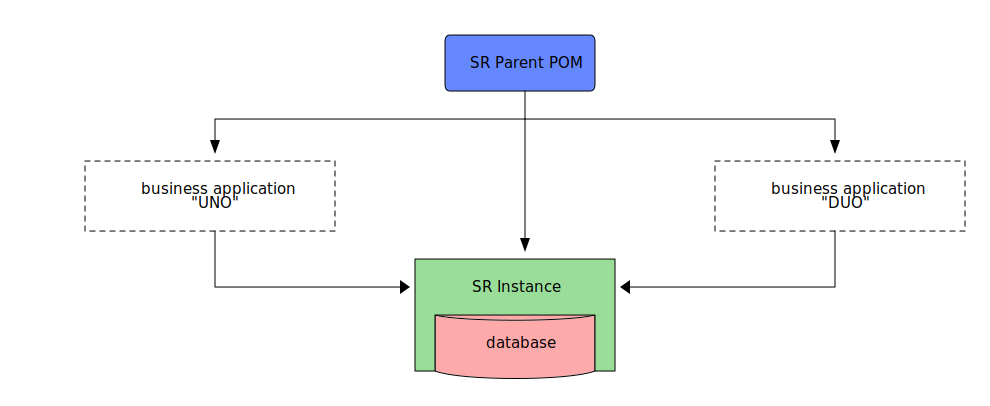

[.text-justify]
= Sling Rocket
:reproducible:
:doctype: article
:author: Herman Ciechanowiec
:email: herman@ciechanowiec.eu
:chapter-signifier:
:sectnums:
:sectnumlevels: 5
:sectanchors:
:toc: left
:toclevels: 5
:icons: font
// Docinfo is used for foldable TOC.
// -> For full usage example see https://github.com/remkop/picocli
:docinfo: shared,private
:linkcss:
:stylesdir: https://www.ciechanowiec.eu/linux_mantra/
:stylesheet: adoc-css-style.css

== Overview

_Sling Rocket_ is a framework for building dynamic web applications.

== Architecture

=== Sling Rocket Components

_Sling Rocket_ consists of three basic parts:
[upperalpha]
. Sling Rocket Parent POM ("*SR Parent POM*")
+
A Maven project object model that declaratively describes basic and universal application components of _Sling Rocket_.
. Sling Rocket Instance ("*SR Instance*")
+
[upperroman]
.. A standalone long-running OSGi container.
.. Serves as the environment inside which business applications are running. Among others, it means that the SR Instance contains default dependencies and configurations that can be used by embedded business applications. The SR Instance itself is responsible for all non-business-related logic.
.. Defined by the SR Parent POM.
.. Has an embedded NoSQL database - Apache Jackrabbit Oak (Java Content Repository, JCR). It can be simultaneously connected to other databases.
+
. Sling Rocket Nginx ("*SR Nginx*")
+
Reverse proxy Nginx server that serves as a gateway between the SR Instance and the outside world. It is responsible for all incoming and outgoing HTTP(S) traffic.

=== Business Applications Development Flow
The development of business applications for _Sling Rocket_ has this flow:

[upperalpha]
. Deploy an SR Instance.
. Develop a business application with the SR Parent POM.
. Deploy the business application to the SR Instance.
. The SR Parent POM will provide the business application with all dependencies and configurations available in the targeted SR Instance. In other words, the SR Parent POM will give the business application the environment in which it will run, as the SR Instance itself was built using the same SR Parent POM.
. The business application can override the default application components of the targeted SR Instance.

.Raw diagram
[%collapsible]
====
[ditaa, shadows=false, separation=false, target=sling-rocket-architecture-diagram, format=svg, opts=inline]
....
                                          /--------------\
                                          |              |
                                          | SR Parent POM|
                                          |   c68F       |
                                          \-------+------/
                                                  |
                   +------------------------------+------------------------------+
                   |                              |                              |
                   v                              |                              v
      +------------------------+                  |                  +------------------------+
      :                        |                  |                  :                        |
      |   business application |                  |                  |   business application |
      |          "UNO"         |                  |                  |          "DUO"         |
      |                        |                  |                  |                        |
      +------------+-----------+                  |                  +-----------+------------+
                   |                              v                              |
                   |                   +-------------------+                     |
                   |                   |                   |                     |
                   +------------------>|    SR Instance    |<--------------------+
                                       | cGRE              |
                                       | +---------------+ |
                                       | |               | |
                                       | |    database   | |
                                       | |{s} cPNK       | |
                                       +-+---------------+-+
....
====

== Usage

The SR Parent POM and SR Instance use matching versions. These versions must match within a given application setup. For example, if the version of the SR Parent POM used is `13.26.0`, the version of the SR Instance must also be `13.26.0`.

=== SR Parent POM

The SR Parent POM is published in the Maven Central Repository. It should be defined as the parent POM of every business application deployed to an SR Instance:
[source, xml]
....
<parent>
    <groupId>eu.ciechanowiec</groupId>
    <artifactId>sling.rocket.parent</artifactId>
    <version>13.26.0</version>
</parent>
....

=== SR Instance

The SR Instance is intended to run as a Docker container with the persistence layer extracted into a separate volume with rolling backups. The image of an SR Instance is published on Docker Hub at `ciechanowiec/rocket-instance`. It is recommended to run and manage the SR Instance using a `docker-compose.yml` file located in the root of this repository:

[source,bash]
....
curl https://raw.githubusercontent.com/ciechanowiec/sling_rocket/main/docker-compose.yml > docker-compose.yml
docker compose up -d
....

==== Persistence and Application Files

Static files related to an SR instance reside in `/opt/sling`. These files are of two types: _persistence files_ and _application files_.

===== Persistence Files

As mentioned earlier, _Sling Rocket_ has an embedded NoSQL database, which is Apache Jackrabbit Oak (Java Content Repository, JCR). There are multiple ways this database can be stored physically on disk. In the case of _Sling Rocket_, the entire database is stored in https://jackrabbit.apache.org/oak/docs/nodestore/segment/overview.html[Segment Node Storage]. All Segment Node Storage files are referred to as _persistence files_ and are located in `/opt/sling/launcher/repository/segmentstore`. Since these persistence files represent the entire database, the `/opt/sling/launcher/repository/segmentstore` directory is the indivisible persistence layer of a given SR Instance. All persistence-related actions must be performed upon that persistence layer, which includes creating, reading, updating, and deleting specific resources from the database, as well as performing general database operations such as backups, relocations, and restorations. Among others, this means that `/opt/sling/launcher/repository/segmentstore` directory:
[upperalpha]
. should be mounted as a persistent Docker volume for a given SR instance,
. should be retained and reused between _Sling Rocket_ updates for a given SR instance.

===== Application Files

Static files related to an SR instance that reside in `/opt/sling` but aren't _persistence files_ are classified as _application files_. These files:
[upperalpha]
. are managed by _Sling Rocket_, meaning that _Sling Rocket_ provides new application files upon every container (re)creation,
. are disposable and, therefore, are not intended to be retained or reused between _Sling Rocket_ updates for a given SR instance,
. do not persistently store any business data.

=== SR Nginx
In general, all traffic to an SR Instance should be routed through the SR Nginx. The SR Nginx is intended to run as a Docker container. The image of an SR Nginx is published on Docker Hub at `ciechanowiec/rocket-nginx`. Just like in case of an SR Instance, it is recommended to run and manage the SR Nginx using a `docker-compose.yml` file located in the root of this repository:

[source,bash]
....
curl https://raw.githubusercontent.com/ciechanowiec/sling_rocket/main/docker-compose.yml > docker-compose.yml
docker compose up -d
....

== Miscellaneous

=== Apache Sling

_Sling Rocket_ is a custom build of the https://sling.apache.org/[Apache Sling] framework. As a starting point for the build, the 13th SNAPSHOT version of the https://github.com/apache/sling-org-apache-sling-starter[Apache Sling Starter] was used.

=== Publishing

Publication of new versions of _Sling Rocket_ consists of the following steps:
[upperalpha]
. Build and publish the SR Parent POM and subordinate artifacts in the Maven Central Repository:
+
[source,bash]
....
cd "$PROJECT_REPO_ROOT"/src/2_rocket-instance/maven-project
mvn clean deploy -P release
....
+
. Build and publish the SR Instance image and SR Nginx image in Docker Hub:
+
[source,bash]
....
cd "$PROJECT_REPO_ROOT"/src
docker compose --progress=plain build
docker push ciechanowiec/rocket-instance:13.26.0 && docker push ciechanowiec/rocket-nginx:13.26.0
....

=== Access Password
By default, _Sling Rocket_ allows access via a user `admin` with the password `admin`. For production deployments this password should be changed according to the respective https://sling.apache.org/documentation/bundles/managing-users-and-groups-jackrabbit-usermanager.html[Apache Sling instruction]. A command to change the password might look the following way:
[source,bash]
....
curl -FoldPwd=admin -FnewPwd=passwordus-novus -FnewPwdConfirm=passwordus-novus \
  http://localhost:8080/system/userManager/user/admin.changePassword.html
....

=== Ideas to be Considered for Implementation

[upperalpha]
. Implementing an https://jackrabbit.apache.org/filevault/installhooks.html[installation hook] for index deployments, similar to https://github.com/code-distillery/filevault-oak-reindex-hook, but should reside in the OSGi container so that it can be referenced by packages.
. Integration tests for the running SR Instance, including additional Apache Felix Health Checks, write-read operations on the JCR repository and Composum console verification. The https://github.com/apache/sling-org-apache-sling-starter/tree/master/src/test/java/org/apache/sling/launchpad[Apache Sling Starter integration tests] can serve as an example.
. JMX plugin for the Apache Felix Web Console.

== License
The program is subject to MIT No Attribution License

Copyright © 2024 Herman Ciechanowiec

Permission is hereby granted, free of charge, to any person obtaining a copy of this software and associated documentation files (the 'Software'), to deal in the Software without restriction, including without limitation the rights to use, copy, modify, merge, publish, distribute, sublicense, and/or sell copies of the Software, and to permit persons to whom the Software is furnished to do so.

The Software is provided 'as is', without warranty of any kind, express or implied, including but not limited to the warranties of merchantability, fitness for a particular purpose and noninfringement. In no event shall the authors or copyright holders be liable for any claim, damages or other liability, whether in an action of contract, tort or otherwise, arising from, out of or in connection with the Software or the use or other dealings in the Software.
