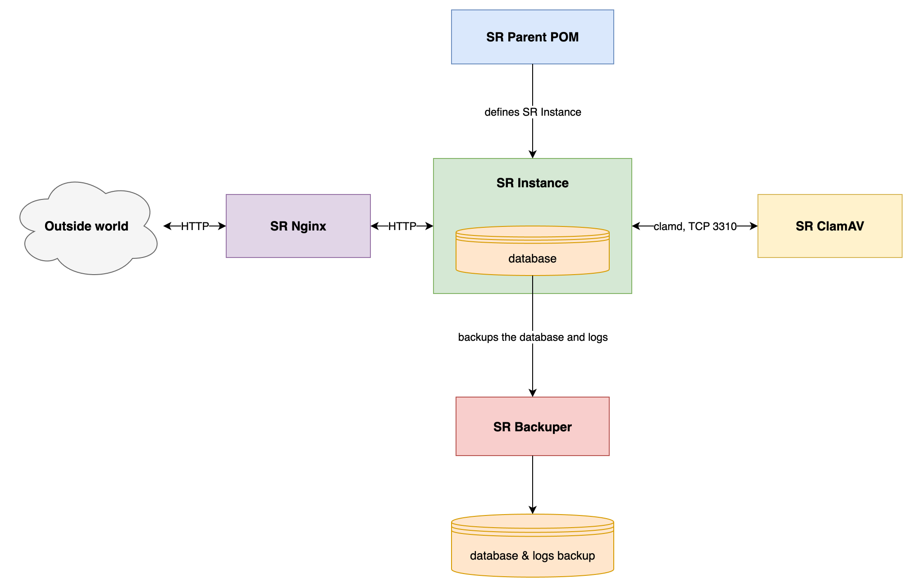
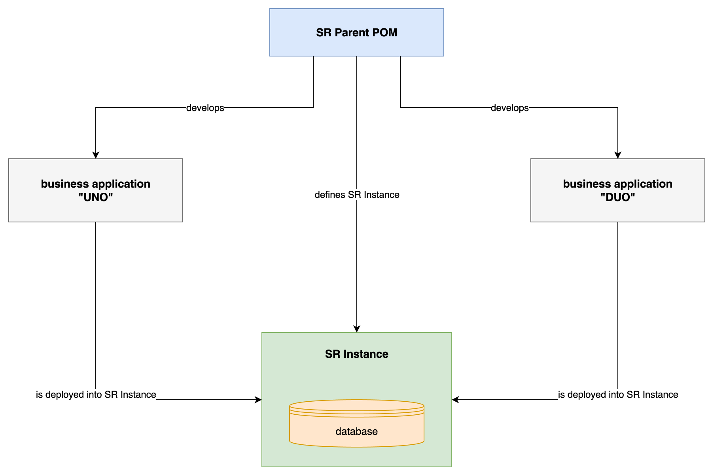
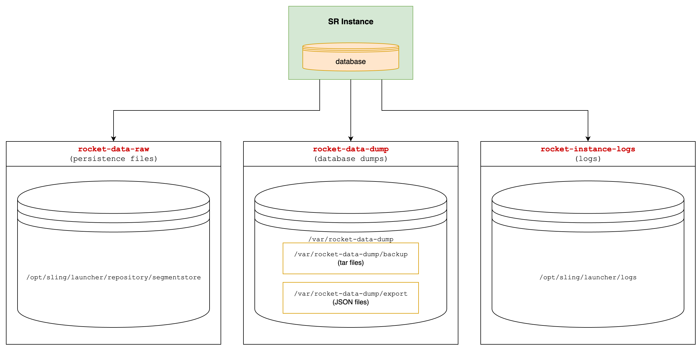
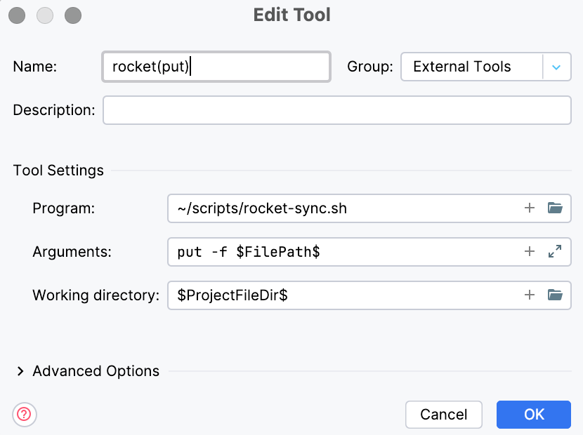
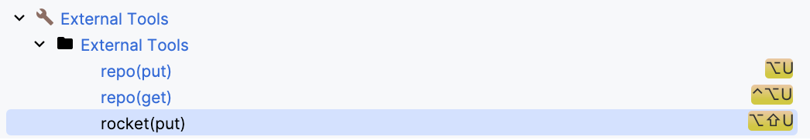
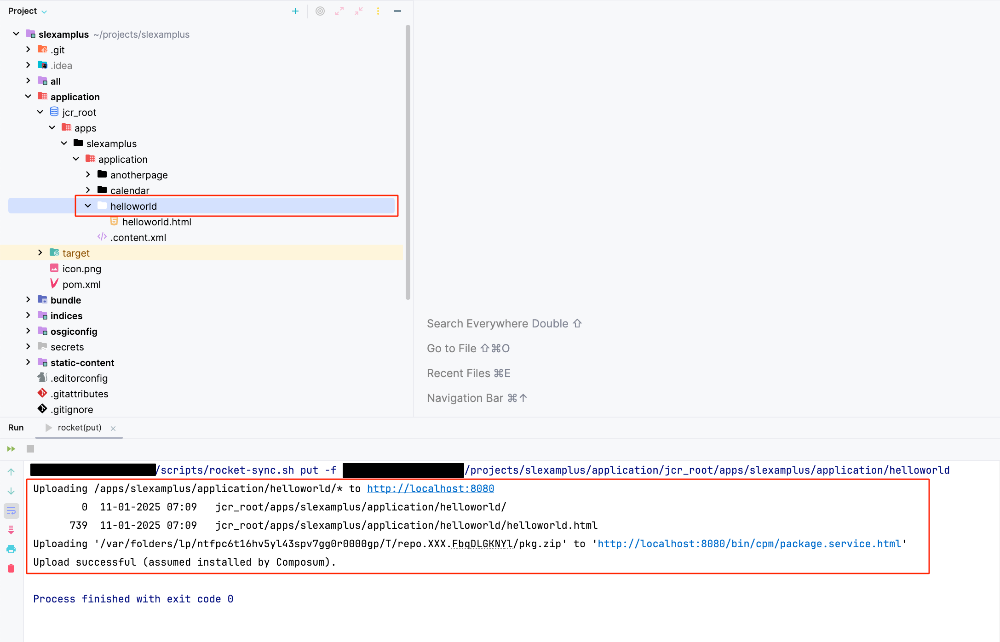

[.text-justify]
= Sling Rocket
:reproducible:
:doctype: article
:author: Herman Ciechanowiec
:email: herman@ciechanowiec.eu
:chapter-signifier:
:sectnums:
:sectnumlevels: 5
:sectanchors:
:toc: left
:toclevels: 5
:icons: font
:docinfo: shared,private
:linkcss:
:sourcedir: {docdir}
:pdf-theme: {sourcedir}/docs/themes/basic.yml
:stylesdir: https://www.ciechanowiec.eu/linux_mantra/
:stylesheet: adoc-css-style.css
:!table-caption:
:!figure-caption:

[cols=">.^1,<.^1"]
|===
| *Document created:* | 2024-01-01 00:00:00 +0100
| *Document last modified:* | {docdatetime}
| *Document generated:* | {localdatetime}
|===

== Overview

_Sling Rocket_ is a framework for building dynamic web applications.

== Architecture

=== Sling Rocket Components

_Sling Rocket_ consists of five basic parts:
[upperalpha]
. Sling Rocket Parent POM ("*SR Parent POM*")
+
A Maven project object model that declaratively describes basic and universal application components of _Sling Rocket_.
. Sling Rocket Instance ("*SR Instance*")
+
.. A standalone long-running OSGi container.
.. Serves as the environment inside which business applications are running. Among others, it means that the SR Instance contains default dependencies and configurations that can be used by embedded business applications. The SR Instance itself is responsible for all non-business-related logic.
.. Defined by the SR Parent POM.
.. Has an embedded NoSQL database - Apache Jackrabbit Oak (Java Content Repository, JCR). It can be simultaneously connected to other databases.
+
. Sling Rocket Backuper ("*SR Backuper*")
+
Application that performs backups of the database and logs via backing them up into a separate destination.
. Sling Rocket Nginx ("*SR Nginx*")
+
Reverse proxy Nginx server that serves as a gateway between the SR Instance and the outside world. It's responsible for all incoming and outgoing HTTP(S) traffic.
. Sling Rocket ClamAV ("*SR ClamAV*")
+
https://www.clamav.net/[ClamAV^] antivirus engine that scans content for the SR Instance. It listens on the clamd protocol (TCP port `3310`) and is reachable exclusively by the SR Instance over a dedicated isolated network.

=== Business Applications Development Flow
The development of business applications for _Sling Rocket_ has this flow:

[upperalpha]
. Deploy an SR Instance.
. Develop a business application with the SR Parent POM.
+
[TIP]
As a template for the business application https://github.com/ciechanowiec/slexamplus[Slexamplus,window=_blank] can be used.
. Deploy the business application to the SR Instance.
. The SR Parent POM will provide the business application with all dependencies and configurations available in the targeted SR Instance. In other words, the SR Parent POM will give the business application the environment in which it will run, as the SR Instance itself was built using the same SR Parent POM.
. The business application can override the default application components of the targeted SR Instance.

== Usage
[[docker-compose]]
=== `docker-compose.yml`
[upperalpha]
. _Sling Rocket_ is supposed to be run and managed using the `docker-compose.yml` file located in the root of this repository.
. The `docker-compose.yml` file defines default setup of _Sling Rocket_ components and can be adjusted according to the specific needs of a given deployment, hence serve as a template for custom deployments.
. The default `docker-compose.yml` contains a setup of the following _Sling Rocket_ components:
[upperroman]
.. SR Instance - `rocket-instance` container.
.. SR Backuper - `rocket-backuper` container.
.. SR Nginx - `rocket-nginx` container.
.. SR ClamAV - `rocket-clamav` container.
. To bootstrap _Sling Rocket_ with a default setup, run the following commands:
+
[source,bash]
....
curl https://raw.githubusercontent.com/ciechanowiec/sling_rocket/main/docker-compose.yml > docker-compose.yml
docker compose up -d
....

=== SR Parent POM and SR Instance Versions
The SR Parent POM and SR Instance use matching versions. These versions must match within a given application setup. For example, if the version of the SR Parent POM used is `26.0.0`, the version of the SR Instance must also be `26.0.0`.

=== SR Parent POM

The SR Parent POM is published in the Maven Central Repository. It should be defined as the parent POM of every business application deployed to an SR Instance:
[source, xml]
....
<parent>
    <groupId>eu.ciechanowiec</groupId>
    <artifactId>sling.rocket.parent</artifactId>
    <version>26.0.0</version>
</parent>
....

=== SR Instance

The SR Instance is intended to run as a Docker container with the persistence and logs layers extracted into separate volumes. The image of an SR Instance is published on Docker Hub at `ciechanowiec/rocket-instance`.

==== Persistence, Log, and Application Files

Static files related to an SR Instance reside in `/opt/sling`. The typical structure of that directory looks this way:
[source,bash]
....
/opt/sling
├── bin <1>
│   ├── launcher
│   └── launcher.bat
├── dump-rocket-data.sh <2>
├── launcher <3>
│   ├── cache
│   ├── framework <4>
│   ├── install <5>
│   ├── logs <6>
│   ├── repository <7>
│   │   ├── index <8>
│   │   ├── segmentstore <9>
│   │   │   ├── data00000a.tar
│   │   │   ├── data00001a.tar
│   │   │   ├── journal.log
│   │   │   ├── manifest
│   │   │   └── repo.lock
│   └── resources
├── lib
│   ├── commons-cli-1.4.jar
│   ├── commons-lang3-3.12.0.jar
│   ├── commons-text-1.10.0.jar
│   ├── jakarta.json-api-2.0.2.jar
│   ├── johnzon-core-1.2.19-jakarta.jar
│   ├── org.apache.felix.cm.json-2.0.0.jar
│   ├── org.apache.sling.feature-2.0.4.jar
│   ├── org.apache.sling.feature.launcher-1.3.4.jar
│   ├── org.osgi.util.converter-1.0.9.jar
│   ├── org.osgi.util.function-1.0.0.jar
│   ├── osgi.core-8.0.0.jar
│   ├── slf4j-api-1.7.25.jar
│   └── slf4j-simple-1.7.25.jar
├── oak-run-2.0.0.jar <10>
├── rocket-instance-starter.sh <11>
└── sling.rocket.feature-26.0.0-oak_tar.far <12>
....
<1> scripts that launch the SR Instance
<2> [[database-dump-script]]script that dumps the database into a separate destination
<3> https://sling.apache.org/documentation/configuration.html[`sling.home`^] directory where basic SR Instance files are stored
<4> https://felix.apache.org/documentation/subprojects/apache-felix-framework/apache-felix-framework-bundle-cache.html[`org.osgi.framework.storage`^] directory with bundles cache
<5> https://sling.apache.org/documentation/bundles/file-installer-provider.html[`sling.fileinstall.dir`^] directory; artifacts put into this directory are automatically installed when SR Instance starts
<6> [[log-files-directory]]https://sling.apache.org/documentation/development/logging.html[conventional directory] for xref:#log-files[log files]
<7> https://jackrabbit.apache.org/oak/docs/osgi_config.html[`repository.home`^] directory where the database files are stored
<8> https://jackrabbit.apache.org/oak/docs/query/lucene.html[`localIndexDir`^] directory where database indexes are stored
<9> [[segment-store-directory]]https://jackrabbit.apache.org/oak/docs/osgi_config.html[`segmentstore`^] directory with xref:#persistence-files[persistence files], i.e. Segment Node Storage files
<10> https://github.com/apache/jackrabbit-oak/blob/trunk/oak-run/README.md[Oak Run tool^] for operations on the database
<11> proxy script that launches the SR Instance
<12> OSGi Feature that describes the SR Instance

All static files residing in `/opt/sling` are of three types: _persistence files_, _log files_ and _application files_.

[[persistence-files]]
===== Persistence Files
As mentioned earlier, _Sling Rocket_ has an embedded NoSQL database, which is Apache Jackrabbit Oak (Java Content Repository, JCR). There are multiple ways this database can be stored physically on disk. In the case of _Sling Rocket_, the entire database is stored in https://jackrabbit.apache.org/oak/docs/nodestore/segment/overview.html[Segment Node Storage^]. All Segment Node Storage files are referred to as _persistence files_ and are located in `/opt/sling/launcher/repository/segmentstore`. Since these persistence files represent the entire database, the `/opt/sling/launcher/repository/segmentstore` directory is the indivisible persistence layer of a given SR Instance. All persistence-related actions must be performed upon that persistence layer, which includes creating, reading, updating, and deleting specific resources from the database, as well as performing general database operations such as backups, relocations, and restorations. Among others, this means that `/opt/sling/launcher/repository/segmentstore` directory:
[upperalpha]
. should be mounted as a persistent volume for a given SR Instance,
. should be retained and reused between _Sling Rocket_ updates for a given SR Instance.

[[log-files]]
===== Log Files
SR Instance writes logs to the xref:#log-files-directory[`/opt/sling/launcher/logs`] directory. All files located in that directory are referred to as _log files_. For auditing purposes, that directory should be mounted as a persistent volume for a given SR Instance.

===== Application Files

Static files related to an SR Instance that reside in `/opt/sling` but aren't _persistence files_ or _log files_ are classified as _application files_. These files:
[upperalpha]
. are managed by _Sling Rocket_, meaning that _Sling Rocket_ provides new application files upon every container (re)creation,
. are disposable and, therefore, aren't intended to be retained or reused between _Sling Rocket_ updates for a given SR Instance,
. don't persistently store any business data.

==== Volumes
SR Instance has three volumes attached to it: `rocket-data-raw`, `rocket-data-dump` and `rocket-instance-logs`.

[[rocket-data-raw]]
===== `rocket-data-raw`
The `rocket-data-raw` volume is mounted at xref:#segment-store-directory[`/opt/sling/launcher/repository/segmentstore`]. It contains all xref:#persistence-files[persistence files] of the SR Instance. Therefore, this volume is the actual database of the SR Instance.

[[rocket-data-dump]]
===== `rocket-data-dump`
The `rocket-data-dump` volume is mounted at `/var/rocket-data-dump`. That path is the destination where the xref:#database-dump-script[`/opt/sling/dump-rocket-data.sh`] script puts the database dumps created out of xref:#persistence-files[persistence files], i.e. out of Segment Node Storage at xref:#segment-store-directory[`/opt/sling/launcher/repository/segmentstore`]. In `/var/rocket-data-dump/backup` directory, the dumps performed via https://jackrabbit.apache.org/oak/docs/nodestore/segment/overview.html#backup[backup^] Oak Run command are stored, i.e. the dumps represented as TAR files with Oak segments. In `/var/rocket-data-dump/export` directory, in turn, the dumps performed via https://github.com/apache/jackrabbit-oak/blob/trunk/oak-run/README.md#export[export^] Oak Run command are stored, i.e. the dumps represented as human-readable JSON files with referenced binary files.

[[rocket-instance-logs]]
===== `rocket-instance-logs`
The `rocket-instance-logs` volume is mounted at xref:#log-files-directory[`/opt/sling/launcher/logs`]. It contains all xref:#log-files[log files] of the SR Instance.

===== Diagram

=== SR Backuper

SR Backuper is an application that performs backups of the database and logs via backing them up into a separate destination on the host machine. It's done via backing up the contents of xref:#rocket-data-raw[`rocket-data-raw`] (xref:#segment-store-directory[`/opt/sling/launcher/repository/segmentstore`]), xref:#rocket-data-dump[`rocket-data-dump` (`/var/rocket-data-dump`)], and xref:#rocket-instance-logs[`rocket-instance-logs`] (xref:#log-files-directory[`/opt/sling/launcher/logs`]) volumes. The exact backup mechanism is configured in the `docker-compose.yml` file.

A single backup is saved in the backups destination folder configured in the `docker-compose.yml` file as a TAR archive. Internally, that archive has the following structure:

[source,bash]
....
rocket-backup-2025-03-01T11-00-00.tar.gz
└── backup
    ├── rocket-data-dump <1>
    │   ├── backup <2>
    │   │   ├── data00000a.tar
    │   │   ├── gc.log
    │   │   ├── journal.log
    │   │   ├── manifest
    │   │   └── repo.lock
    │   └── export <3>
    │       ├── blobs
    │       └── nodestates.json
    ├── rocket-data-raw <4>
    │   ├── data00000a.tar
    │   ├── data00001a.tar
    │   ├── journal.log
    │   ├── manifest
    │   └── repo.lock
    └── rocket-instance-logs <5>
        ├── access.log
        ├── error.log
        ├── query.log
        └── request.log
....
<1> content of `rocket-data-dump` volume (`/var/rocket-data-dump`)
<2> content of `/var/rocket-data-dump/backup` path from the `rocket-data-dump` volume
<3> content of `/var/rocket-data-dump/export` path from the `rocket-data-dump` volume
<4> content of `rocket-data-raw` volume (`/opt/sling/launcher/repository/segmentstore`)
<5> content of `rocket-instance-logs` volume (`/opt/sling/launcher/logs`)

==== Backups Trigger
Backups are performed regularly and automatically according to the schedule configured in the `docker-compose.yml` file.

A backup can also be triggered manually by running the following command:
[source,bash]
....
docker exec rocket-backuper backup
....

==== Backups Restoration
The database can be restored both from the `rocket-data-dump` volume backup, as well as from the `rocket-data-raw` volume backup. The first one is the recommended way of restoring the database and can be performed as follows:

[upperalpha]
. Remove SR Instance container (`rocket-instance`), SR Backuper container (`rocket-backuper`) and volumes (`rocket-data-raw`, `rocket-data-dump` and `rocket-instance-logs`):
+
[source,bash]
....
docker container rm -f rocket-instance rocket-backuper
docker volume rm rocket-data-raw rocket-data-dump rocket-instance-logs
....

. Restore the backup archive that contains the persistence files into a new `rocket-data-raw` volume before running a new `rocket-instance` container.
+
Assuming that backups are stored in the `$HOME/backups` directory and the backup archive is named `rocket-backup-2026-04-10T01-00-00.tar.gz`, you can use a command structure like the following:
+
[source,bash]
....
docker run \
  --interactive \
  --tty \
  --rm \
  --volume rocket-data-raw:/restore \
  --volume "$HOME/backups:/archive:ro" \
  alpine \
  tar --extract --verbose --gzip \
      --file /archive/rocket-backup-2026-04-10T01-00-00.tar.gz \
      --directory /restore \
      --strip-components=3 \
      backup/rocket-data-dump/backup
....
+
In the example above:
[upperroman]
.. The volume `rocket-data-raw` (where the restored persistent files will be located) is mounted at `/restore` inside the temporary container.
.. The local backups directory (`$HOME/backups`) is mounted in read-only mode at `/archive` inside the temporary container.
.. The `tar` command expands the backup archive that contains the persistent files into `/restore`, thereby placing all persistent files from the archive there.
.. The `--strip-components=3` parameter removes the first two path components from the extracted files (due to the default structure of the backups).

. In the `volumes` section of the `docker-compose.yml` file, adjust the `rocket-data-raw` configuration by adding the `external: true` parameter:
+
[source,yml]
....
volumes:
    rocket-data-raw:
        name: "rocket-data-raw"
        external: true
....

. Run a new `rocket-instance` container. It will automatically attach itself to the newly created `rocket-data-raw` volume, ensuring that the restored SR Instance state (i.e., persistent files) is accurately reflected in the running application.

=== SR Nginx
In general, all traffic to an SR Instance should be routed through the SR Nginx. The SR Nginx is intended to run as a Docker container. The image of an SR Nginx is published on Docker Hub at `ciechanowiec/rocket-nginx`.

[upperalpha]
. The image of an SR Nginx includes a default configuration file at `/etc/nginx/nginx.conf`. This file is a template that can be customized according to the specific needs of a given deployment. Among others, it can be done via overriding that file by mounting a custom configuration file from the host machine to the container, e.g. this way:
+
[source,yml]
....
volumes:
  - type: bind
    source: infra/nginx.conf
    target: /etc/nginx/nginx.conf
    read_only: true
....
. The SR Nginx includes the https://github.com/owasp-modsecurity/ModSecurity[ModSecurity WAF module^] with https://coreruleset.org/docs/[OWASP Core Rule Set (CRS)^] and https://github.com/mitchellkrogza/nginx-ultimate-bad-bot-blocker[Ultimate Nginx Bad Bot Blocker^].
. *Logs*
[upperroman]
.. The logs for the Nginx itself (`access.log` and `error.log`) and for the ModSecurity WAF module (`modsec_audit.log`) are stored in the `/var/log/nginx` directory inside the container. It's recommended to mount that directory as a persistent volume for a given SR Nginx container, e.g. this way:
+
[source,yml]
....
volumes:
  - type: volume
    source: rocket-nginx-logs
    target: /var/log/nginx
....
.. Logs are configured for rotation in the `/etc/logrotate.d/nginx` configuration file. If needed, that file can be overridden by mounting a custom configuration file from the host machine to the container, e.g. this way:
+
[source,yml]
....
volumes:
  - type: bind
    source: infra/nginx-logrotate.conf
    target: /etc/logrotate.d/nginx
    read_only: true
....

=== SR ClamAV
The SR ClamAV is a https://www.clamav.net/[ClamAV^] antivirus engine that scans content for the SR Instance, e.g. uploaded assets. It's intended to run as a Docker container. The image of an SR ClamAV is published on Docker Hub at `ciechanowiec/rocket-clamav`.

[upperalpha]
. *Network Isolation*
[upperroman]
.. The SR ClamAV listens for the https://docs.clamav.net/manual/Usage/Scanning.html#clamd[clamd protocol^] on TCP port `3310` and is reachable exclusively by the SR Instance at `rocket-clamav:3310` over a dedicated `rocket-clamav-network` network. That port isn't published to the host machine, and other containers, among them the SR Nginx, aren't connected to that network, so neither the outside world nor those containers can reach the SR ClamAV.
.. The `rocket-clamav-network` network is deliberately not declared as `internal`, because freshclam, the virus definitions update service running inside the SR ClamAV container, needs internet egress to download the definitions.
. *Configuration*
+
The image of an SR ClamAV includes a configuration file at `/etc/clamav/clamd.conf` with tuning described in the `src/5_rocket-clamav/clamd.conf` file of this repository, among others the maximum size of a single scanned data stream (`StreamMaxLength`), which must not be lower than the effective upload limits of the SR Instance. The configuration can be customized via overriding that file by mounting a custom configuration file from the host machine to the container, e.g. this way:
+
[source,yml]
....
volumes:
  - type: bind
    source: ./clamd.conf
    target: /etc/clamav/clamd.conf
    read_only: true
....
. *Virus Definitions*
+
Virus definitions are stored in the `/var/lib/clamav` directory inside the container, which is extracted into the `rocket-clamav-data` volume, so that the definitions persist across container restarts. That volume is deliberately not backed up by the SR Backuper, because the definitions are re-downloadable and would bloat the backup archives.
. *Java API*
+
Business applications scan content against the SR ClamAV through the `VirusScanner` OSGi service from the `eu.ciechanowiec.sling.rocket.clamav` package published by the SR Instance. By default, the service points to `rocket-clamav:3310`, so it's fully functional without any explicit configuration. No method of the service ever throws: every scan produces one of three explicit results, so that a scanner failure can't be confused with clean content:
+
[source,java]
....
@Reference
private VirusScanner virusScanner;
// ...
switch (virusScanner.scan(inputStream)) {
    case Clean clean -> allow();
    case Infected infected -> reject(infected.signatureName());
    case Failed failed -> handleScannerFailure(failed.details());
}
....

[[custom-ca-certificates]]
=== Custom CA Certificates

A _custom CA certificate_ is a certificate of a certificate authority that isn't part of the default trust stores of the _Sling Rocket_ Docker images. A typical source of custom CA certificates is a TLS-intercepting proxy: such a proxy re-signs HTTPS traffic with its own certificate authority, so HTTPS connections from the containers fail certificate verification unless that certificate authority is trusted. _Sling Rocket_ can attach custom CA certificates both at image build time and at container runtime.

[upperalpha]
. *Build Time*
+
Custom CA certificates in PEM format with the `.crt` extension dropped into the `src/commons/extra-ca-certificates` directory of this repository are installed into the trust stores of the built Docker images: into the system CA store of `rocket-base`, `rocket-nginx`, and `rocket-clamav`, and additionally into the Java keystore of `rocket-base`. The directory ships empty because Git ignores `.crt` files in it. Builds without custom CA certificates therefore aren't affected.
. *Runtime*
+
Images built without custom CA certificates, e.g. the prebuilt images from Docker Hub, can have such certificates attached at runtime. To attach them, mount a directory with the certificates to `/usr/local/share/ca-certificates/extra` of the `rocket-instance`, `rocket-nginx`, and `rocket-clamav` containers, e.g. this way:
+
[source,yml]
....
volumes:
  - type: bind
    source: ./extra-ca-certificates
    target: /usr/local/share/ca-certificates/extra
    read_only: true
....
+
The startup scripts of those containers install all certificates found in that directory on every container start: into the system CA store and, for `rocket-instance`, also into the Java keystore.
. *Exporting Certificates of a TLS-Intercepting Proxy*
[upperroman]
.. To reveal a TLS-intercepting proxy, check the issuer of the certificate presented for an arbitrary HTTPS connection:
+
[source,bash]
....
openssl s_client -connect repo.maven.apache.org:443 </dev/null 2>/dev/null \
  | openssl x509 -noout -issuer
....
+
On a machine behind such a proxy, the issuer isn't the genuine certificate authority of the requested host, but the proxy itself, e.g.:
+
[source,bash]
....
issuer=C=US, ST=NY, L=New York, O=Example Org, CN=ca.example-proxy.com
....
.. From the common name (`CN`), extract the proxy's bare domain: the second-to-last dot-separated label, i.e. the label directly before the trailing `.com`, `.net` etc. For the common name `ca.example-proxy.com`, the bare domain is `example-proxy`. Take specifically that label and not a more specific prefix. A proxy can operate more than one certificate authority. The common names of those certificate authorities differ in prefixes but share the bare domain, e.g. `ca.division-one.example-proxy.com` and `ca.division-two.example-proxy.com`. Every one of them should be exported, since the proxy can switch between them over time.
.. All the certificates of the proxy are expected to be among the certificates trusted by the host machine. For example, on macOS they can be exported from the system keychain by matching the bare domain extracted above:
+
[source,bash]
....
security find-certificate -a -p -c example-proxy /Library/Keychains/System.keychain \
  | awk '/-----BEGIN CERTIFICATE-----/{n++} {print > sprintf("custom-ca-%02d.crt", n)}'
....
+
The `-c` option of the `security find-certificate` command matches every certificate whose name contains the given string. In the command above, that string is the bare domain `example-proxy` extracted in the previous step. The `awk` command splits the matched certificates into separate files in the current working directory: `custom-ca-01.crt`, `custom-ca-02.crt` etc. Therefore run the export in the directory from which _Sling Rocket_ picks the certificates up. For the build time attachment, that directory is `src/commons/extra-ca-certificates` of this repository. For the runtime attachment, that directory is the one mounted to `/usr/local/share/ca-certificates/extra` of the containers. Before the export, delete the `custom-ca-*.crt` files left from previous exports. The file numbering restarts at `01` on every export, so an export that matches fewer certificates than a previous one overwrites only the first files. The remaining files of the previous export would survive and would be installed into the trust stores alongside the new certificates.
.. Verify the export by listing the subject of every exported certificate:
+
[source,bash]
....
for FILE in custom-ca-*.crt; do openssl x509 -in "$FILE" -noout -subject; done
....

== Miscellaneous

=== Apache Sling

_Sling Rocket_ is a custom build of the https://sling.apache.org/[Apache Sling,window=_blank] framework. As a starting point for the build, the 14th SNAPSHOT version of the https://github.com/apache/sling-org-apache-sling-starter[Apache Sling Starter,window=_blank] was used.

=== Building & Publishing

==== Public
Public building and publication of new versions of _Sling Rocket_ is driven by GitHub workflows defined at `.github/workflows` directory. It consists of two following steps:
[upperalpha]
. Build and publish the SR Parent POM and subordinate artifacts in the Maven Central Repository via running the `.github/workflows/release-maven-artifacts.yaml` workflow.
. Build and publish the SR Instance image, SR Nginx image, and SR ClamAV image in Docker Hub via running the `.github/workflows/release-docker-images.yaml` workflow.

==== Local
Local builds of _Sling Rocket_ consist of two following steps:
[upperalpha]
. Build the SR Parent POM and subordinate artifacts, and install them in the local Maven Central Repository:
+
[source,bash]
....
cd "$PROJECT_REPO_ROOT"/src/2_rocket-instance/maven-project
mvn clean install
....
+
. Build _Sling Rocket_ images:
+
[source,bash]
....
cd "$PROJECT_REPO_ROOT"/src
docker compose --progress=plain build
....

[[web-api-exposure]]
=== Web API Exposure

To ensure architectural consistency and leverage the native resource resolution capabilities of Apache Sling, it's recommended that _Sling Rocket_ business applications expose web APIs according to the resource-oriented specification described below.

==== Path and Node Specification

Web APIs should be exposed via a standardized Uniform Resource Identifier (URI) structure that maps directly to a persistent content structure in the JCR.

[upperalpha]
. *URI Path Schema*
+
The recommended schema for API paths is:
+
`/api/<domain-name>/<api-name>`
. *JCR Node Existence*
+
The URI path shouldn't be virtual. It's advised that the path corresponds to an existing JCR node hierarchy. For a target API identified as `search` within a domain named `adbco`, the full path `/api/adbco/search` should exist as a sequence of nodes in the JCR.
. *Resource Type Definition*
+
The terminal node of the path (the node representing `<api-name>`) should explicitly define a `sling:resourceType` property. This property identifies the resource type used for servlet resolution.
+
. *Example*
+
[cols="1,2", options="header"]
|===
^|Property ^|Value

|Path
|`/api/adbco/search`

|Property Name
|`sling:resourceType`

|Property Value
|`api/adbco/search`
|===

==== Servlet Registration

It's recommended to decouple request processing logic from https://sling.apache.org/documentation/the-sling-engine/servlets.html#example-registration-by-path[specific abstract paths] and https://sling.apache.org/documentation/the-sling-engine/servlets.html#example-registration-by-resource-type-etc[bind it instead to resource types].

[upperalpha]
. *Resource Type Binding*
+
Servlets should be registered using the OSGi DS component property https://sling.apache.org/documentation/the-sling-engine/servlets.html#servlet-registration[`sling.servlet.resourceTypes`]. The value should match the https://sling.apache.org/documentation/the-sling-engine/resources.html#resource-types[`sling:resourceType`] property defined on the target JCR node.
. *Path Binding*
+
Registering servlets via absolute paths (https://sling.apache.org/documentation/the-sling-engine/servlets.html#servlet-registration[`sling.servlet.paths`]) https://sling.apache.org/documentation/the-sling-engine/servlets.html#caveats-when-binding-servlets-by-path[is discouraged] for business APIs. Adhering to resource type binding ensures that the Apache Sling Resource Resolver remains the central authority for mapping requests to resources.

=== JCR Structure
[upperalpha]
. It's recommended that business applications deployed to an SR Instance follow the JCR structure described in this section.
. The JCR tree recommended in this section isn't exhaustive and only covers the foundational nodes:
+
[source,bash]
....
/
├── api <1>
│   └── <domain-name> <2>
├── apps <3>
│   └── <domain-name> <4>
│       ├── application <5>
│       ├── install <6>
│       └── osgiconfig <7>
├── content <8>
│   └── <domain-name> <9>
├── home <10>
│   ├── users <11>
│   └── groups <12>
├── libs <13>
├── oak:index <14>
└── var <15>
    ├── eventing <16>
    └── packages <17>
....
<1> Root node for exposing xref:#web-api-exposure[web APIs].
<2> Node for exposing xref:#web-api-exposure[web APIs] for a business application.
<3> Technical static resources required specifically for a given framework deployment.
<4> Technical static resources required specifically for a given business application deployment.
<5> Business application resources required for web rendering (e.g., HTML Template Language (HTL) scripts, JavaScript scripts, icons, fonts).
<6> Business application artifacts to be https://sling.apache.org/documentation/bundles/jcr-installer-provider.html#configuration-and-scanning[installed automatically] upon deployment.
<7> OSGi configurations (`.config`, `.cfg.json`) to be https://sling.apache.org/documentation/bundles/configuration-installer-factory.html[installed automatically] upon deployment.
<8> User-generated mutable content.
<9> User-generated mutable content for the business application.
<10> Root node for the storage of security principals (users and groups).
<11> Storage location for https://github.com/apache/jackrabbit-oak/blob/trunk/oak-core/src/main/java/org/apache/jackrabbit/oak/security/user/UserConfigurationImpl.java[individual user nodes].
<12> Storage location for https://github.com/apache/jackrabbit-oak/blob/trunk/oak-core/src/main/java/org/apache/jackrabbit/oak/security/user/UserConfigurationImpl.java[individual group nodes].
<13> Technical static resources required generally for every framework deployment.
<14> https://jackrabbit.apache.org/oak/docs/query/indexing.html#index-definitions[Index definitions].
<15> Transient and system-generated data, such as logs, audit trails, and temporary files.
<16> Location where https://sling.apache.org/documentation/bundles/apache-sling-eventing-and-job-handling.html[Sling Jobs are persisted].
<17> Location where https://sling.apache.org/documentation/bundles/content-package-installer-factory.html[JCR Package Manager] stores packages.

. The following https://sling.apache.org/documentation/bundles/repository-initialization.html[repository initialization script] defines the recommended ACL model for business users:
+
[source,txt]
----
create group acme-business-users with path /home/groups/acme-groups

set ACL for acme-business-users
    remove * on /
    deny jcr:all on /

    remove * on /api/acme
    allow jcr:read on /api/acme

    remove * on /apps/acme/application
    allow jcr:read on /apps/acme/application

    remove * on /content/acme
    allow jcr:read on /content/acme
end
----

=== Useful Links

The list below contains useful links to default administration tools of an SR instance.
[upperalpha]
. JCR Browser:
+
http://localhost:8080/bin/browser.html
. OSGi bundles:
+
http://localhost:8080/system/console/bundles
. OSGi components:
+
http://localhost:8080/system/console/components
. OSGi configurations:
+
http://localhost:8080/system/console/configMgr
. Requests tracker:
+
http://localhost:8080/system/console/requests
. Online logs:
+
http://localhost:8080/system/console/slinglog

=== Production Deployments

This section describes selected topics that should be considered for production deployments of _Sling Rocket_.
[upperalpha]
. *Apache Sling Referrer Filter*
+
Configure the https://github.com/apache/sling-org-apache-sling-security?tab=readme-ov-file#referrer-filter-csrf-protection[_Apache Sling Referrer Filter_] to allow only specific hosts.
. *Disable Debug Mode*
+
Disable the debug mode. To achieve this, unset the `JAVA_DEBUG_PORT` environmental variable in the xref:#docker-compose[].
. *`admin` Password*
+
By default, _Sling Rocket_ allows access via a user `admin` with the password `admin`. For production deployments this password should be changed according to the respective https://sling.apache.org/documentation/bundles/managing-users-and-groups-jackrabbit-usermanager.html[Apache Sling instruction,window=_blank]. A command to change the password might look the following way:
+
[source,bash]
....
curl --user "admin:admin" --verbose -FoldPwd=admin -FnewPwd=passwordus-novus -FnewPwdConfirm=passwordus-novus \
  http://localhost:8080/system/userManager/user/admin.changePassword.html
....
. *_Lighthouse_*
+
Analyze the performance of the web pages with the https://github.com/GoogleChrome/lighthouse[_Lighthouse_] tool and fix detected problems.
. *JCR Query Audit*
[upperroman]
.. Monitor JCR query statistics available in the JMX beans listed below and address the detected problems:
[lowergreek]
... `org.apache.jackrabbit.oak: Oak Query Statistics (QueryStat)`
... `org.apache.jackrabbit.oak: Oak Query Statistics (Extended) (QueryStats)`
.. To investigate the details of how a given JCR query performs, the following JMX bean can be used:
+
`eu.ciechanowiec.sling.rocket.engine: QueryInvestigation (JCR)`
. *JCR Version Cleanup*
+
Configure the JCR version cleanup with `org.apache.sling.jcr.maintenance.internal.VersionCleanupPath`.
. *SR ClamAV Memory Sizing*
+
The SR ClamAV holds the full virus definitions database in RAM, which results in a memory footprint of several gigabytes. Size the host machine accordingly. The `ConcurrentDatabaseReload no` setting baked into the image keeps the additional memory spike during definition reloads down.
. *Security Tests*
[upperroman]
.. *Zed Attack Proxy (ZAP) Tests*
+
Run https://www.zaproxy.org/[ZAP^] security tests.
[upperroman]
... The basic test can be performed with the use of the command constructed the following way:
+
[source, bash]
----
docker run -t ghcr.io/zaproxy/zaproxy:stable zap-full-scan.py -t https://example.com
----
... Security headers can be added to the above command the following way:
+
[source, bash]
----
docker run -t \
    -e ZAP_AUTH_HEADER="Cookie" \
    -e ZAP_AUTH_HEADER_VALUE="SESSION=6a08d33d-a242-40f9-b172-d69c8bab868f" \
    ghcr.io/zaproxy/zaproxy:stable zap-full-scan.py \
    -t https://example.com
----
.. *Nuclei*
... Run https://github.com/projectdiscovery/nuclei[_Nuclei_] security tests.
... The basic test can be performed with the use of the command constructed the following way:
+
[source, bash]
----
nuclei -target http://localhost/content/form.html -stats -si 10 -rl 15 -c 10 -bs 5 \
    -H "User-Agent: Mozilla/5.0 (Windows NT 10.0; Win64; x64)" \
    -H "Referer: http://localhost/content/form.html" \
    -H "Cookie: SESSION=6a08d33d-a242-40f9-b172-d69c8bab868f" \
    -t http \
    -em "fingerprinthub-web-fingerprints:openfire,tech-detect:jsdelivr,tech-detect:font-awesome,tech-detect:bootstrap,http-missing-security-headers:clear-site-data,http-missing-security-headers:missing-content-type" \
    -eid "form-detection,options-method" \
    -o matches.txt -elog errors.txt
----

. *Disable Unsafe Extensions*
+
Depending on the needs of the business application, consider disabling unsafe rendering extensions, i.e. https://sling.apache.org/documentation/bundles/rendering-content-default-get-servlets.html[`json`, `xml` and `txt` extensions of `DefaultGetServlet`]. Among others, this can be achieved via creating a `org.apache.sling.servlets.get.DefaultGetServlet.cfg.json` OSGi configuration with the following content:
+
[source,json]
----
{
  "enable.json": false,
  "enable.txt": false,
  "enable.xml": false
}
----
. *Request Size and Encoding*
[upperroman]
.. The https://github.com/apache/sling-org-apache-sling-engine/blob/dce8005d0cf8917c94b2871f0e9a5207dee633a5/src/main/java/org/apache/sling/engine/impl/parameters/RequestParameterSupportConfigurer.java#L133[`org.apache.sling.engine.parameters`] should be configured. Firstly, the `sling.default.parameter.encoding` parameter should be set to `UTF-8` to ensure that all request parameters are correctly interpreted as UTF-8 encoded. Secondly, the `file.max` and `request.max` parameters should be set to appropriate values to prevent denial-of-service attacks via excessively large requests.
+
For example, to achieve the above, the following `org.apache.sling.engine.parameters.cfg.json` OSGi configuration can be created:
+
[source,json]
----
{
  "sling.default.parameter.encoding": "UTF-8",
  "file.max": "$[env:MAX_REQUEST_SIZE;type=Integer;default=20000000]",
  "request.max": "$[env:MAX_REQUEST_SIZE;type=Integer;default=20000000]"
}
----
.. [[file-size-deployment-limitations]]Setting size limits in `sling.default.parameter.encoding` will limit _all_ requests to the SR Instance, including requests whose purpose is to deploy business applications via https://wcm.io/tooling/maven/plugins/wcmio-content-package-maven-plugin/install-mojo.html[Content Package Maven Plugin] and https://www.composum.com/home/nodes/pckgmgr.html[Composum Package Manager]. In such cases the following approach is recommended:
[lowergreek]
... Set the `file.max` and `request.max` parameters with the use of an environment variable, e.g., `MAX_REQUEST_SIZE`, that will be https://github.com/apache/felix-dev/blob/master/configadmin-plugins/interpolation/README.md[interpolated].
... For local development, the respective environment variable, e.g., `MAX_REQUEST_SIZE`, can be set to a large value (e.g., `MAX_REQUEST_SIZE=20000000`) to allow for the deployment of business applications without any issues.
... For production deployments, the respective environment variable, e.g., `MAX_REQUEST_SIZE`, can be set to a smaller value (e.g., `MAX_REQUEST_SIZE=1000000`). However, if the value isn't sufficient for deploying a business application, it can be temporarily increased to allow for the deployment and then decreased again to the original value to ensure that the SR Instance is protected against excessively large requests.
.. Additionally, to prevent excessively large requests, the https://nginx.org/en/docs/http/ngx_http_core_module.html#client_max_body_size[`client_max_body_size`] directive of the SR Nginx should be set to an appropriate value (e.g., `client_max_body_size 1M;`).
+
[TIP]
This setting doesn't introduce xref:#file-size-deployment-limitations[file-size-related limitations] on the business application deployment, since the deployment targets SR Instance directly, while this setting applies to requests that are routed through the SR Nginx.

=== `rocket-sync.sh`

==== Overview

_Sling Rocket_ delivers a `src/4_rocket-sync/rocket-sync.sh` utility, which is a Bash script. It facilitates the synchronization of Java Content Repository (JCR) content, structured in accordance with FileVault, from a local file system to a running SR Instance.

The utility operates on a specified path that resides within a `jcr_root` directory. For the given path, it dynamically constructs a content package. This package contains a single filter that encapsulates the entire subtree of the specified path. Subsequently, the package is uploaded to the target SR Instance and installed via the Composum Package Manager.

Run the `rocket-sync.sh --help` command to learn how to use the utility.

==== Integration with IntelliJ IDEA

The `rocket-sync.sh` utility can be integrated with IntelliJ IDEA as described below to ease the development.

[NOTE]
The instructions below are for UNIX.

[upperalpha]
. Download and save the `rocket-sync.sh` utility on a local machine, e.g., in the `~/scripts` directory:
+
[source,bash]
....
curl https://raw.githubusercontent.com/ciechanowiec/sling_rocket/main/src/4_rocket-sync/rocket-sync.sh > ~/scripts/rocket-sync.sh
....
. Set up the `rocket-sync.sh` utility as an _External Tool_ in IntelliJ IDEA.
[upperroman]
.. Go to _Settings_ -> _Tools_ -> _External Tools_.
.. Add the `rocket-sync.sh` utility as an _External Tool_.
+

[lowergreek]
... _Name_: `rocket(put)`
... _Program_: the local directory where the `rocket-sync.sh` utility is stored, e.g., `~/scripts/rocket-sync.sh`
... _Arguments_: `put -f $FilePath$`
... _Name_: `$ProjectFileDir`
.. Assign the `rocket-sync.sh` utility a keyboard shortcut.
+

[lowergreek]
... Got to _Settings_ -> _Keymap_ -> _External Tools_ -> _External Tools_.
... Assign the _rocket(put)_ a desired keyboard shortcut.
.. To run the `rocket-sync.sh` utility on the local directory or file, put focus on that directory/file in the file view in IntelliJ IDEA. After that, press the configured shortcut, which will trigger the immediate synchronization.
+

=== Ideas to be Considered for Implementation

[upperalpha]
. Implementing an https://jackrabbit.apache.org/filevault/installhooks.html[installation hook,window=_blank] for index deployments, similar to https://github.com/code-distillery/filevault-oak-reindex-hook, but should reside in the OSGi container so that it can be referenced by packages.
. Integration tests for the running SR Instance, including additional Apache Felix Health Checks, write-read operations on the JCR repository and Composum console verification. The https://github.com/apache/sling-org-apache-sling-starter/tree/master/src/test/java/org/apache/sling/launchpad[Apache Sling Starter integration tests,window=_blank] can serve as an example.
. JMX plugin for the Apache Felix Web Console.
. i18n support.

== About the Document

This document uses https://asciidoc.org[AsciiDoc^] markup language and resides in the project repository.

=== Export
. To export the document to the supported output formats, install the following tools:
.. https://asciidoctor.org/#installation[Asciidoctor^]
.. https://docs.asciidoctor.org/pdf-converter/latest/install/[Asciidoctor PDF^]
.. https://pandoc.org/installing.html[Pandoc^]
. To export to HTML:
+
[source,bash]
----
asciidoctor --attribute allow-uri-read README.adoc
----
. To export to PDF:
+
[source,bash]
----
asciidoctor-pdf --attribute allow-uri-read --require ./docs/lib/auto-list-style.rb README.adoc
----
. To export to DOCX - Asciidoctor converts the document to DocBook XML, which Pandoc then converts to DOCX:
+
[source,bash]
----
asciidoctor --backend docbook --attribute allow-uri-read --out-file - README.adoc | pandoc --from docbook --to docx --output README.docx
----

=== Linting

==== General Rules
. https://vale.sh[Vale^] lints the document.
. Vale enforces the following style guides:
.. Native https://vale.sh/docs/styles#vale[Vale style^], with https://github.com/vale-cli/en_US-web/tree/master[English dictionary] included.
.. modified https://developers.google.com/style[Google Developer Documentation Style Guide^] via the https://github.com/vale-cli/Google[Google package^]
.. modified https://vale.sh/hub/jdkato/write-good/[write-good linter^] via the https://github.com/vale-cli/write-good[write-good package^]
.. https://github.com/amperser/proselint/[proselint^] via the https://github.com/vale-cli/proselint[proselint package^]
.. custom project rules
. Vale configuration is in `link:.vale.ini[]`.

==== Usage
. Install Vale as described in the https://vale.sh/docs/install/[official documentation].
. Lint the document:
+
[source,bash]
----
vale README.adoc
----

++++
<!-- vale off -->
++++

== License
The program is subject to MIT No Attribution License

Copyright © 2024-2026 Herman Ciechanowiec

Permission is hereby granted, free of charge, to any person obtaining a copy of this software and associated documentation files (the 'Software'), to deal in the Software without restriction, including without limitation the rights to use, copy, modify, merge, publish, distribute, sublicense, and/or sell copies of the Software, and to permit persons to whom the Software is furnished to do so.

The Software is provided 'as is', without warranty of any kind, express or implied, including but not limited to the warranties of merchantability, fitness for a particular purpose and noninfringement. In no event shall the authors or copyright holders be liable for any claim, damages or other liability, whether in an action of contract, tort or otherwise, arising from, out of or in connection with the Software or the use or other dealings in the Software.

++++
<!-- vale on -->
++++
