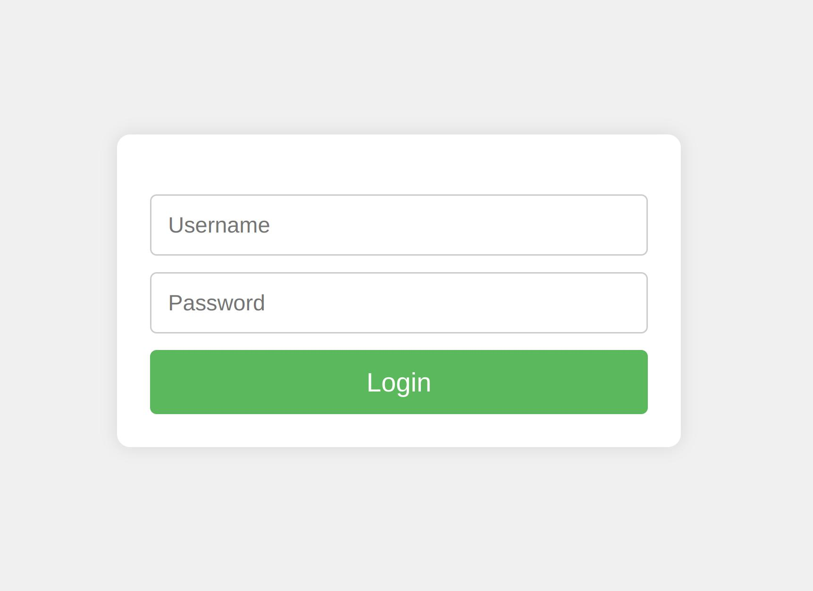

[.text-justify]
= Sling Rocket // Custom Login Form
:reproducible:
:doctype: article
:author: Herman Ciechanowiec
:email: herman@ciechanowiec.eu
:chapter-signifier:
:sectnums:
:sectnumlevels: 5
:sectanchors:
:toc: left
:toclevels: 5
:icons: font
// Docinfo is used for foldable TOC.
// -> For full usage example see https://github.com/remkop/picocli
:docinfo: shared,private
:linkcss:
:stylesdir: https://www.ciechanowiec.eu/linux_mantra/
:stylesheet: adoc-css-style.css

== Overview

Custom login form that overrides the default one used by Apache Sling.

Apache Sling Auth Core (`org.apache.sling.auth.core`) and Apache Sling Form Based Authentication (`org.apache.sling.auth.form`) deliver a default HTML login form. Additionally, those packages allow for overriding the default form with a custom form supplied in an OSGi fragment attached to `org.apache.sling.auth.form` bundle. This bundle delivers such a form and attaches itself to the mentioned bundle, effectively replacing the default login interface.

== License
The program is subject to MIT No Attribution License

Copyright © 2024-2026 Herman Ciechanowiec

Permission is hereby granted, free of charge, to any person obtaining a copy of this software and associated documentation files (the 'Software'), to deal in the Software without restriction, including without limitation the rights to use, copy, modify, merge, publish, distribute, sublicense, and/or sell copies of the Software, and to permit persons to whom the Software is furnished to do so.

The Software is provided 'as is', without warranty of any kind, express or implied, including but not limited to the warranties of merchantability, fitness for a particular purpose and noninfringement. In no event shall the authors or copyright holders be liable for any claim, damages or other liability, whether in an action of contract, tort or otherwise, arising from, out of or in connection with the Software or the use or other dealings in the Software.
